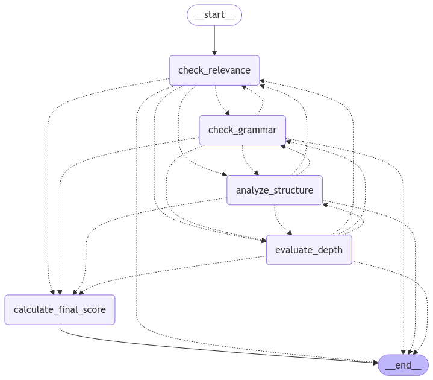

# AI-Writing-Grading-System

A AI-based intelligent writing grading system that scores and analyzes essays for relevance, grammar, structure, and depth using LangChain and LLM. Simply input your essay to receive a comprehensive evaluation and a final score.

#### AI Agents Flow Diagram

#### Features
📋 Relevance Scoring: Measures how well the essay aligns with the given topic.

✍️ Grammar Analysis: Evaluates the grammatical correctness and language quality.

📐 Structure Assessment: Analyzes the organizational structure of the essay.

🔍 Depth Evaluation: Assesses the depth and quality of analysis in the essay.

⚡ Final Score Calculation: Combines all scores with customizable weightings to provide an overall evaluation.

#### Use Cases

For grading various types of written content, such as:

    Academic Essays: Evaluate student submissions for relevance, grammar, and structure.
  
    Professional Reports: Assess clarity and depth of analysis in business or technical documents.
  
    Creative Writing: Provide feedback on story structure and language use.
  
    Self-Assessment: Help writers refine their skills with detailed AI-driven insights.

This system can also be adapted to grade other types of works, such as:

    Research Papers: Analyze coherence, depth, and formatting.

    Speeches and Presentations: Evaluate structure, clarity, and delivery impact.
  
    Resumes and Cover Letters: Provide feedback on language, tone, and relevance to job roles.
